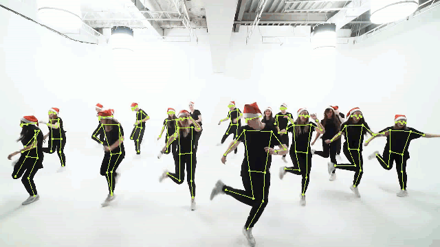
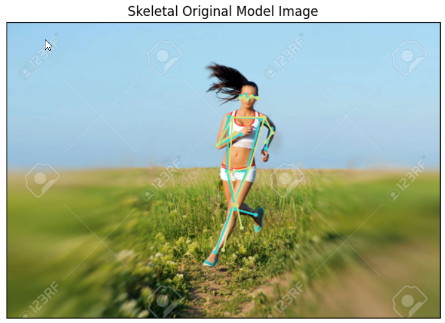
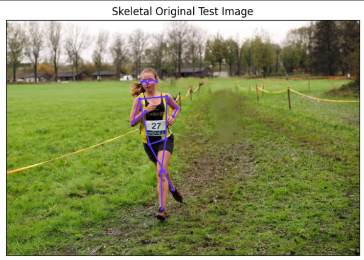
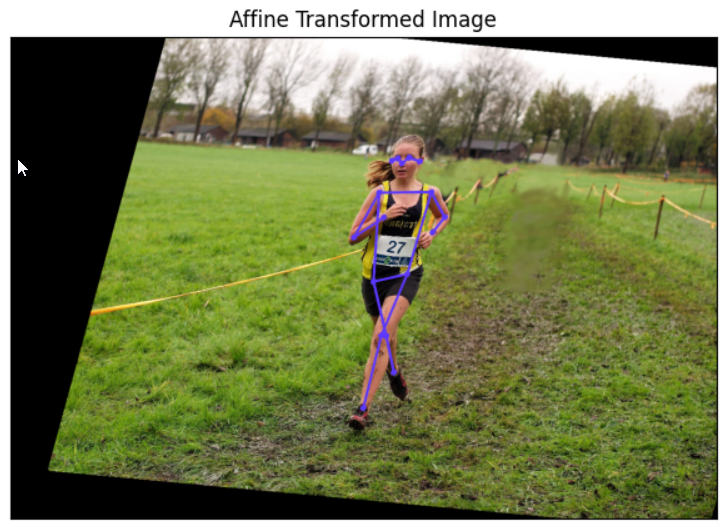

  
# The «Synchro Dancing» project.
--------------------
 

## Contents
[Contents](./README.md#Introduction)  
[Using](./README.md#Сustomization) 
[Operation package](./README.md#Operation) 
[Additionally](./README.md#Additionally) 
[Presentation file](./README.md#Presentation) 

----------------------------------
## Introduction
This project compares the pose of a model dancer (teacher) with a student dancer and interactively displays metrics of cosine similarity and weighted cosine similarity in percentages. At the end of the video, the final scores for each dancer are displayed for 30 frames. Metrics are set if the number of people is between 1 and 5, estimates above this number are not calculated, since it does not make sense - all metric values simply do not fit on the screen.  
  
   
*Metrics are not displayed ─ the number of dancers is more than 5.*
  
At any time, you can pause the video, select, for example, the worst metric and discuss with the student how to correct this pose during the dance.  

:arrow_up: [Contents](./README.md#Contents) 

## Сustomization
1. Clone the repository.
2. Copy the required video file to the `video` folder.
3. In the script `main.py` set the required `PATH_DIR` and `NAME_FILE`.
4. Launch `main.py`.

:arrow_up: [Contents](./README.md#Contents) 

## Operation
1. The analysis of the video file is carried out, the number of dancers is determined by the first frame. If further, during the playback of the video, their number will change, then such frames are cut. 
2. Frame-by-frame cosine similarity and weighted cosine similarity are calculated using affine transformation.
3. The average value of the weighted cosine similarity for each dancer is added to the end of the video.
4. The video is saved.

:arrow_up: [Contents](./README.md#Contents) 

## Additionally
The following files are located in the `examples` folder:
1. `01-carcas.ipynb`. Drawing a person's pose.
2. `02-compare_poses.ipynb`. Calculation of cosine similarity using affine transformation. Let's take a look at how it works.
  
   
*This is the image of the model.*  
  
   
*This is a test image. It is necessary that the pose of the person in the test picture is most similar to the pose of the model.*
   
   
*The affine transformation will help us in this. This is the pose of the person in the test picture after applying the affine transformation.*   
  
3. `03-video_skeleton.ipynb`. Creating videos with the drawing of poses and names of dancers.
  
These files come as separate, independent project assignments. Each of them works independently of each other.

:arrow_up: [Contents](./README.md#Contents) 

## Presentation
The presentation file of this project is located [here "presentation.ppt"](https://disk.yandex.ru/i/7bRcYdttoJHVkw).  
I recommend opening it in full-screen mode (reading mode).  
